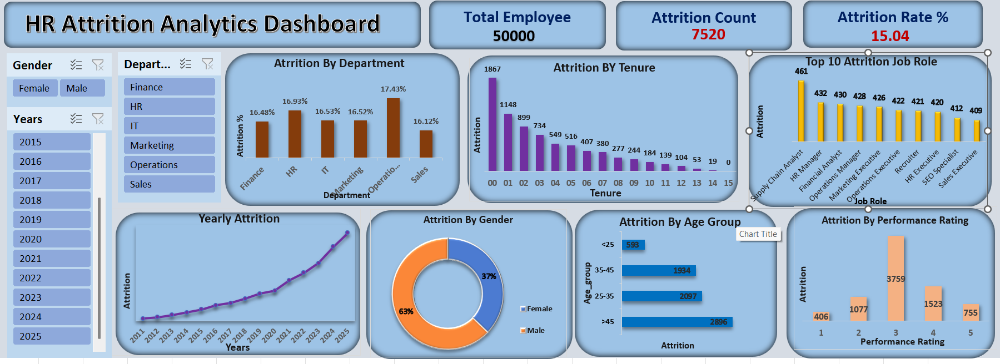

# HR Attrition Analytics Dashboard 📊

## 📌 Project Overview
This project analyzes employee attrition patterns using HR data of **50,000+ employees**.
The objective is to identify key drivers of attrition and provide actionable, data-driven insights to improve employee retention and workforce planning.

---

## 🗂 Dataset Information
- Records: 50,000 employees
- Features: 16 columns
- Data includes employee demographics, job roles, performance ratings, tenure, salary, and attrition status.

---

## 🛠 Tools & Technologies
- Excel
- Power BI
- Data Analysis
- Data Visualization
- HR Analytics

---

## 📊 Key KPIs
- Total Employees: 50,000
- Attrition Count: 7,520
- Attrition Rate: 15.04%

---

## 🔍 Key Insights
- ~40% of attrition occurs within the first 2 years of tenure.
- Operations (17.43%) and HR (16.93%) departments show highest attrition.
- Employees with Performance Rating 3 account for the highest attrition.
- Senior employees (>45 years) show increased attrition risk.

---

## 💡 Business Recommendations
- Improve onboarding and early employee engagement.
- Introduce role-based retention strategies for high-risk departments.
- Focus on motivating average performers through growth and recognition.
- Strengthen succession planning for senior workforce.

---

## 📷 Dashboard Preview

---

## 🔗 LinkedIn Project
[View Project on LinkedIn](https://www.linkedin.com/in/lalit-patil-63b6212ba/overlay/Project/2055485438/treasury/?profileId=ACoAAEyfVE8BZMbYqNF53SwHvss6Zg-gvwmJPJ4)
